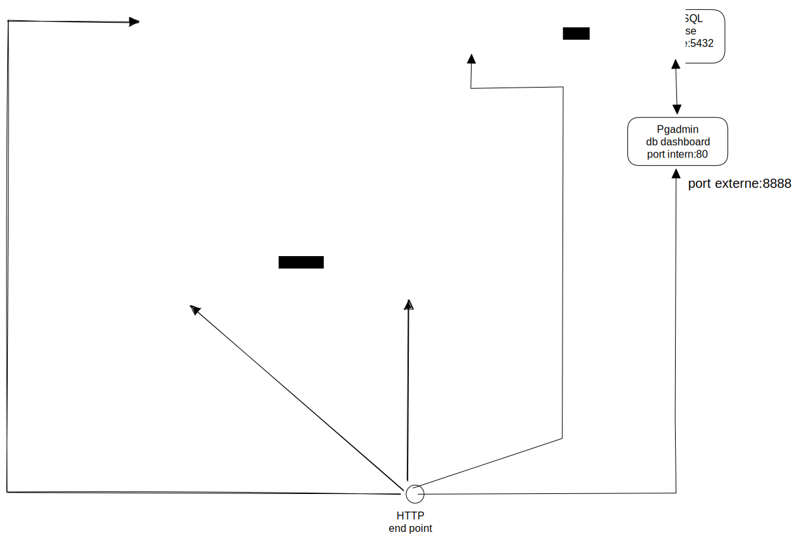
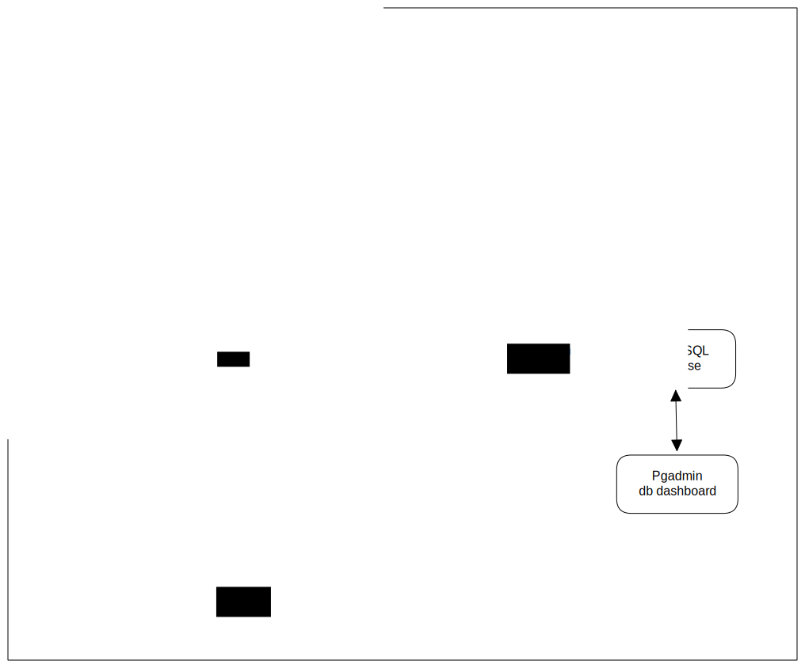

<h1 align="center"> Architecture logiciel</h1>

# Sommaire

1. [Architeture du projet](#architecture-du-projet)
2. [Liste des services et états](#liste-des-services-et-leurs-états)
3. [Utilisation](#utilisation)

# Architecture du projet
## Architecture de production

## Architecture de développement

## Architecture de tests


### Organisation du repo

* /angular -> le code du projet angular avec ses dockerfiles
* /architecture -> les images du readme
* /benchmark -> configuration load testing & monitoring
* /nest -> code du projet nest avec son dockerfile
* /quarkus -> code du projet quarkus
* .env -> fichier de variable
* default.conf -> fichier de configuration de nginx

## Explication
L’objectif de ce projet était de reprendre notre projet de web (front et back, database) d’y ajouter un service de notification en utilisant un service MOM et Quarkus. Le tout devait être sous docker avec des tests et du monitoring.

Pour le service MOM, nous avons choisi d'utiliser RabbitMQ car c'est un choix populaire, de plus, il est open-source, fiable et facile à utiliser. 
Il prend en charge de nombreux protocoles de communication, sans compter une bonne documentation sur l'implémentation par NestJS et Quarkus.

Nous devions mettre en place un système pour exposer le moins de port possible en production.

Nous avons donc différentes architectures en fonction de quel mode on se trouve : production, development ou test.


## Mode production

Dans ce mode, on retrouve **NGINX** qui est utilisé comme un reverse proxy pour filtrer les requêtes entrantes. Mail il sert aussi de serveur web client (le code angular est mis dans le service nginx).


## Mode test et dev

En mode test et développement, angular (front-end) est un service à part entière et nginx n’est pas présent.

Dans les 2 cas Angular communique avec le service API.

On retrouve notre back-end en **NestJS** qui sert de service API et qui communique avec le service de database **PostgreSQL** pour enregistrer les données. L’API utilise une _message queue_ **RabbitMQ** (service MOM) pour envoyer des messages de manière asynchrone.

**Quarkus microservice** est utilisé ici pour consommer les messages de la queue et envoie des mails en utilisant SMTP.

**Maildev** permet de simuler un serveur **SMTP** et de voir les mails envoyés. Il récupère donc les mails envoyés par **Quarkus**.

Nous avons décidé de ne pas mettre le load testing & monitoring dans le mode prod ou dev car nous avons trouver plus judieux de créer un mode rien que pour ceux-là. Pour une question de nombre de conteneur, il aurait été aussi possible de rajouter le monitoring dans le mode prod.


## Autre architecture

Il aurait été possible de construire une d’autre architecture, on peut notamment penser à un **SSO **(single sign on) basé sur une autre API détachée de celle actuelle. On aurait pu encore faire des micros service nestJS (un par entité) mais cela ne semblait pas réellement judicieux compte tenu du peu de logique métier.

Il aurait été judicieux de créer une lib partagé entre **NestJS** et **Angular** (écrits tous les deux en TypeScript) pour partager le code des entités et des services (logique métier).

Une base de données **NoSQL** aurait pu aussi être utilisée, mais cela demande d’être beaucoup plus prudent sur les associations entre entités.

On aurait pu mettre du **load balancing** en place avec le **backend**, pour éviter d’avoir un dénis de service sur toute l’API, on aurait au moins un deuxième serveur de secours.


# Liste des services et leurs états

Nous avons implémenté différents services :


| Nom                             | mode            | Etat                        |
|---------------------------------|-----------------|-----------------------------|
| fr-admin-db (postgres)          | dev, prod, test | implémenté                  |
| fr-admin-back (nestJS)          | dev,prod,test   | implémenté, testé, monitoré |
| fr-admin-front (angular)        | dev,test        | implémenté                  |
| pgadmin                         | dev,test,prod   | implémenté                  |
| rabbitMQ                        | dev,test,prod   | implémenté                  |
| mailer (Quarkus)                | dev,test,prod   | implémenté                  |
| maildev                         | dev,test,prod   | implémenté                  |
| nginx (angular + reverse proxy) | prod            | implémenté                  |
| grafana                         | test            | implémenté                  |
| prometheus                      | test            | implémenté                  |
| k6                              | test            | implémenté                  |
| statsd                          | test            | implémenté                  |


## Les options de config


### Backend

| VARIABLE       | DESCRIPTION                                                            | VALEUR PAR DEFAUT    |
|----------------|------------------------------------------------------------------------|----------------------|
| RABBITMQ_URL   | l’url de rabbitMQ                                                      | amqp://rabbitmq:5672 |
| DB_USERNAME    | le nom pour se connecter à la base                                     | admin                |
| DB_PASSWORD    | le mot de passe pour se connecter à la base                            | password             |
| DB_HOST        | le service de base de données                                          | fr-admin-db          |
| DB_BASE        | le nom de la base de données                                           | fr-admin             |
| SWAGGER_PREFIX | le préfix de l’url de l’api pour le swagger (à cause du reverse proxy) | /api                 |


### PostgreSQL

| VARIABLE    | DESCRIPTION                | VALEUR PAR DEFAUT |
|-------------|----------------------------|-------------------|
| DB_USERNAME | le nom du user par défaut  | admin             |
| DB_BASE     | le nom de la base à créer  | fr-admin          |
| DB_PASSWORD | le mot de passe par défaut | password          |


### Pgadmin

| VARIABLE                 | DESCRIPTION                                  | VALEUR PAR DEFAUT    |
|--------------------------|----------------------------------------------|----------------------|
| PGADMIN_DEFAULT_EMAIL    | le nom par défaut pour se connecter          | pgadmin4@pgadmin.org |
| PGADMIN_DEFAULT_PASSWORD | le mot de passe par défaut pour se connecter | admin                |


Nous avons mis en place un .env, de ce fait le docker-compose utilise le contenu du .env, nous avons donc plus qu'à modifier seulement le .env et à ne plus toucher au docker-compose.

On aurait pu améliorer le système de configuration du projet :


* donner l’url de l’api à angular par environnement
* donner les variables d'environnement à quarkus
* utiliser des variables pour faire passer les ports et services à NGINX
* utiliser la surcharge des .env (chose que nous avons essayé, mais pas réussi)

Nous aurions pu aussi rajouter un utilisateur de base dans l’api pour se connecter.


# Utilisation

Après clonage du projet :

Concernant le quarkus nous avons dû faire un choix de production.

En effet, docker permet de ne pas dépendre des différentes versions de logiciel des développeurs car un conteneur à ses propres configuration.

Cependant, construire un conteneur qui build le projet quarkus à l’intérieur (et donc sans avoir d’installer java en local) cela peut prendre 10 à 15 minutes. Ce qui peut être très long pour des petits déplacements.

Nous avons laissé cette configuration dans le docker-compose.

Mais si pour une raison de temps et de processeur, vous préférez être un peu plus rapide il vous faut installer un JDK et préciser sa version dans le fichier pom.xml donc avoir maven d’installer aussi.

Changer la version du jdk dans le quarkus/pom.xml pour build le projet en local

```xml
<maven.compiler.release>11</maven.compiler.release>
```

Changer l'image de quarkus dans le docker-compose.prod.yml:

```yml
mailer:
 build:
 context:  ./quarkus/
 dockerfile:  src/main/docker/Dockerfile.dev.jvm
```


## Installation

Pour utiliser le mode dev et le hot reloading (ne pas avoir à build l’image à chaque fois que l’on fait une modification de code) vous devez :


### Quarkus


* Installer un JDK
* Installer maven ou utiliser le wrapper fourni.

Sur quarkus nous devons compiler le projet en local et donc cela dépend de notre JDK. C’est pourquoi vous devez mettre une version égale ou inférieure à votre JDK dans le pom.xml.


### Backend Nest

Votre machine doit avoir node.js d’installé et par conséquent npm.

### Préparation au mode dev 

Puis exécuter :

```console
$ cd angular
$ npm install
$ cd ../nest
$ npm install
$ cd ../quarkus
$ chmod +x ./mvnw
$ sudo ./mvnw install
$ sudo ./mvnw package -Dquarkus.profile=dev
```

## Exécution en mode DEV

Mettez-vous à la racine du projet

```console
$ sudo docker-compose -f docker-compose.dev.yml up
```

Ouvrez un autre terminal :

```console
$ cd ./quarkus
$ sudo ./mvnw quarkus:remote-dev -Dquarkus.live-reload.url=[http://localhost:8080](http://localhost:8080) -Dquarkus.profile.dev
```

Dans ce mode vous avez le hot reload pour nest, angular et quarkus ce qui vous évite de rebuild les conteneur à chaque fois

| Service             | Endpoint                                            |
|---------------------|-----------------------------------------------------|
| back-end / api      | [localhost:3030](http://localhost:3030)             |
| swagger API         | [localhost:3030/api](http://localhost:3030/api)     |
| rabbitmq management | [localhost:15672](http://localhost:15672)           |
| quarkus             | [localhost:8080](http://localhost:8080)             |
| maildev             | [localhost:1080](http://localhost:1080)             |
| angular             | [localhost:4200](http://localhost:4200)             |
| pgadmin             | [localhost:8888](http://localhost:8888)             |

Pour avoir accès au management de rabbitmq utilisez :
* user : guest
* password : guest

Pour avoir accès au pgadmin:
* user: pgadmin4@pgadmin.org
* password : admin


## Exécution en mode PROD

```console
$ sudo docker-compose -f docker-compose.prod.yml up
```

Ce qui peut être intéressant d’explorer c’est un script de lancement.

En effet, l’attribut “depends_on” dans le docker-compose ne garantit pas que les services soient prêts.

Pour remédier à cela, il faudrait donc mettre en place un script qui lance des requêtes (pour connaître le statut des services dans les conteneurs) et lancer les conteneurs à la suite.


| Service             | Endpoint                                                  |
|---------------------|-----------------------------------------------------------|
| front-end / angular | [localhost:8080](http://localhost:8080)                   |
| backend / api       | [localhost:8080/api](http://localhost:8080/api)           |
| Swagger API         | [localhost:8080/api/api](http://localhost:8080/api/api)   |
| maildev             | [localhost:8080/maildev](http://localhost:8080/maildev)   |
| rabbitmq management | [localhost:8080/rabbitmq](http://localhost:8080/rabbitmq) |
| pgadmin             | [localhost:8080/pgadmin](http://localhost:8080/pgadmin)   |


Pour avoir accès au management de rabbitmq utilisez :
* user : guest
* password : guest

Pour avoir accès au pgadmin:
* user: pgadmin4@pgadmin.org
* password : admin

Les images utilisés dans le mode prod pour quarkus, nginx et nestjs sont des images build à l'avance et push sur un repo. 
Cela vous évite de build par vous même. Nous avons fait ce choix car normalement c'est un pipeline Git qui se charge de construire les images et de les pushs.

Cependant si pour une raison vous voulez build par vous même le conteneur voici les instructions :


| Conteneur     | Dockerfile                                        |
|---------------|---------------------------------------------------|
| nginx         | ./angular/Dockerfile.prod                         |
| mailer        | ./quarkus/src/main/docker/Dockerfile.native-micro |
| fr-admin-back | ./nest/Dockerfile                                 |

Vous devez donc remplacer dans le docker-compose.prod.yml


```yml
image: registry.gitlab.com/dembeefr/esir/nginx-front
```

par :

```yml
    build:
      context: ./nest/
      dockerfile: Dockerfile
```
## Exécution en mode TEST

Concernant le load testing, nous avons utilisé k6 pour sa bonne documentation et qu’il soit aussi maintenu régulièrement.

Ce dernier lance un script permettant de simplement tester l’endpoint “/api” en 3 phases et exporte les données sur un serveur statsd destiné à traiter les données pour que Prometheus puisse le récupérer.

De là Grafana s’occupe d’afficher les données récoltées par Prometheus et affiché dans le dashboard des metrics lié au backend nest.

Pour lancer cela, il faut donc exécuter la commande :

```console
$ sudo docker-compose -f docker-compose.test.yml up
```

Lors du load testing, il est possible de monitorer la charge dans grafana à cette URL :

http://localhost:3000/

Le user et le password par défaut sont : `guest` et `guest`

Pour relancer le load test, nous pouvons relancer le service k6 via cette commande :

```console
$ docker-compose -f docker-compose.test.yml run k6
```

# Envoyer des notifications

Pour utiliser le système de messagerie voici la démarche à suivre :


* Aller sur l’API swagger
* Dans la catégorie “user” effectuer la requête POST avec les bons attributs
* Rendez-vous sur l’URL du front, connectez-vous avec les bons attributs (id et password)
* Créer une association et y ajouter des users.
* Cliquer sur une fiche d’associations, puis sur le bouton “events”
* Aller sur le mail de maildev et les mails sont arrivés !


# Nombre minimal de port

Pour s’assurer d’avoir un nombre minimal de ports ouvert, nous avons mis en place des redirections avec NGINX. Il y a seulement le port `8080` qui exposé à l’extérieur, c’est nginx qui est responsable de rediriger vers les bons services internes. Pour cela il se sert de l’URL.

En termes de sécurité, on pourrait améliorer certaines choses :


* Définirs des droits et des users autres que root dans les images
* Créer des comptes pour chaque service avec différents privilèges autre que les comptes de bases
